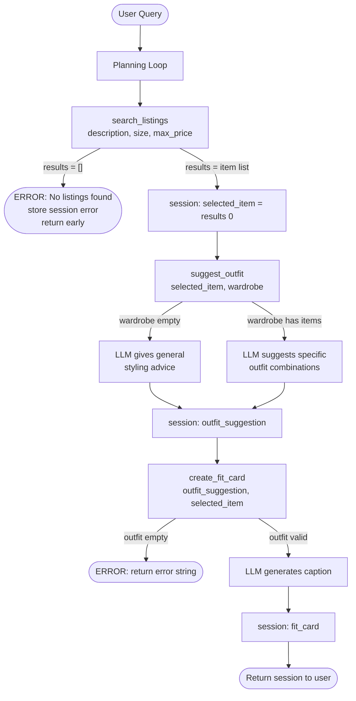

# FitFindr — planning.md

> Complete this document before writing any implementation code.
> Your spec and agent diagram are what you'll use to direct AI tools (Claude, Copilot, etc.) to generate your implementation — the more specific they are, the more useful the generated code will be.
> Your planning.md will be reviewed as part of your submission.
> Update it before starting any stretch features.

---

## Tools

List every tool your agent will use. For each tool, fill in all four fields.
You must have at least 3 tools. The three required tools are listed — add any additional tools below them.

### Tool 1: search_listings

**What it does:**
Searches the mock listings dataset and returns items that match the user's description, size, and price limit. Results are scored by keyword overlap and sorted by relevance.

**Input parameters:**
- `description` (str): A natural language description of the item the user is looking for (e.g. "vintage graphic tee")
- `size` (str | None): The clothing size to filter by (e.g. "M"), or None to skip size filtering. Matching is case-insensitive.
- `max_price` (float | None): The maximum price the user is willing to pay (inclusive), or None to skip price filtering.

**What it returns:**
A list of matching listing dicts sorted by relevance score (best match first). Each dict contains: id, title, description, category, style_tags (list), size, condition, price (float), colors (list), brand, platform. Returns an empty list if nothing matches — does not raise an exception.

**What happens if it fails or returns nothing:**
The agent stores an error message in the session: "No listings found for your search. Try a broader description, a different size, or a higher price limit." It stops and does not call suggest_outfit.

---

### Tool 2: suggest_outfit

**What it does:**
Given a specific thrifted item and the user's wardrobe, uses an LLM to suggest 1–2 complete outfit combinations using pieces the user already owns.

**Input parameters:**
- `new_item` (dict): A listing dict returned by search_listings (the item the user is considering buying)
- `wardrobe` (dict): A dict with an 'items' key containing a list of wardrobe item dicts. Each item has: id, name, category, colors (list), style_tags (list), notes. May be empty.

**What it returns:**
A non-empty string with outfit suggestions and styling advice. If the wardrobe is empty, returns general styling advice for the item rather than crashing or returning an empty string.

**What happens if it fails or returns nothing:**
If wardrobe['items'] is empty, the agent calls the LLM with a prompt for general styling ideas (what kinds of pieces pair well, what vibe the item suits). It still returns a useful string rather than raising an exception.

---

### Tool 3: create_fit_card

**What it does:**
Generates a short, shareable, caption-style description of the complete outfit — the kind of thing someone would post on Instagram or TikTok.

**Input parameters:**
- `outfit` (str): The outfit suggestion string returned by suggest_outfit
- `new_item` (dict): The selected listing dict, used for price and platform details

**What it returns:**
A 2–4 sentence string written in casual social media style. Mentions the item name, price, and platform naturally. Sounds different each time for different inputs (higher LLM temperature). If outfit is empty, returns a descriptive error message string instead of raising an exception.

**What happens if it fails or returns nothing:**
If outfit is an empty or whitespace-only string, the tool returns: "Could not generate a fit card — outfit description was missing." It does not raise an exception.

---

### Additional Tools (if any)

None for required implementation.

---

## Planning Loop

**How does your agent decide which tool to call next?**

1. Call search_listings with the user's description, size, and max_price.
2. Check if results is empty.
   - If yes → store error message in session["error"], return session early. Do NOT call suggest_outfit.
   - If no → store session["selected_item"] = results[0], proceed to step 3.
3. Call suggest_outfit with session["selected_item"] and the user's wardrobe.
4. Store the returned string in session["outfit_suggestion"].
5. Call create_fit_card with session["outfit_suggestion"] and session["selected_item"].
6. Store the result in session["fit_card"].
7. Return the completed session to the user.

The agent's behavior changes based on what search_listings returns — it does not call all three tools unconditionally.

---

## State Management

**How does information from one tool get passed to the next?**

A session dict tracks all state within one interaction:
- session["selected_item"]: the top listing dict from search_listings
- session["outfit_suggestion"]: the string returned by suggest_outfit
- session["fit_card"]: the string returned by create_fit_card
- session["error"]: an error message string if any tool fails, otherwise None

Each tool receives its inputs directly from the session dict. No data needs to be re-entered by the user between steps. The session is initialized at the start of run_agent() and returned at the end.

---

## Error Handling

For each tool, describe the specific failure mode you're handling and what the agent does in response.

| Tool | Failure mode | Agent response |
|------|-------------|----------------|
| search_listings | No results match the query | Store in session["error"]: "No listings found for your search. Try a broader description, a different size, or a higher price limit." Return session early — do not call suggest_outfit. |
| suggest_outfit | Wardrobe is empty | Call LLM with a prompt for general styling advice for the item. Return that string instead of crashing or returning empty. |
| create_fit_card | Outfit input is missing or incomplete | Return error string: "Could not generate a fit card — outfit description was missing." Do not raise an exception. |

---

## Architecture

---

## AI Tool Plan

**Milestone 3 — Individual tool implementations:**

For search_listings: I'll give Claude the Tool 1 spec from this file (inputs, return value, failure mode) and ask it to implement the function in tools.py using load_listings() from data_loader. I'll verify the generated code filters by all three parameters and handles the empty-results case. Then I'll test it with 3 queries before moving on.

For suggest_outfit: I'll give Claude the Tool 2 spec from this file and ask it to implement suggest_outfit() in tools.py using the Groq client with llama-3.3-70b-versatile. I'll verify it handles the empty wardrobe case and returns a non-empty string. I'll test with both an empty wardrobe and an example wardrobe.

For create_fit_card: I'll give Claude the Tool 3 spec from this file and ask it to implement create_fit_card() in tools.py. I'll verify it guards against empty outfit input and that running it multiple times on the same input produces varied output.

**Milestone 4 — Planning loop and state management:**

I'll give Claude the Planning Loop section and Architecture diagram from this file and ask it to implement run_agent() in agent.py. I'll verify the generated code branches on empty search results, stores values in the session dict, and does not call all three tools unconditionally. I'll test both the happy path and the no-results path before moving on.

---

## A Complete Interaction (Step by Step)

**Example user query:** "I'm looking for a vintage graphic tee under $30. I mostly wear baggy jeans and chunky sneakers. What's out there and how would I style it?"

**Step 1:**
The agent calls search_listings("vintage graphic tee", size=None, max_price=30.0). The function loads all listings, filters to items under $30, scores each by keyword overlap with "vintage graphic tee", and returns a sorted list. Top result: {"id": "lst_033", "title": "Vintage Band Tee — Faded Grey", "price": 19.0, "platform": "depop", "condition": "fair", ...}

**Step 2:**
results is not empty, so session["selected_item"] = results[0] (the band tee). The agent calls suggest_outfit(selected_item, wardrobe). The wardrobe contains baggy straight-leg jeans and chunky white sneakers. The LLM returns: "Pair this faded band tee with your baggy dark wash jeans and chunky white sneakers for a classic 90s streetwear look. Tuck the front corner slightly for shape and layer a black denim jacket over the top on cooler days."

**Step 3:**
session["outfit_suggestion"] = the suggestion string above. The agent calls create_fit_card(outfit_suggestion, selected_item). The LLM returns a caption like: "found this faded band tee on depop for $19 and it was made for my baggy jeans era 🖤 sometimes thrift luck just hits different"

**Final output to user:**
All three output panels populate: the search result panel shows the band tee listing details, the outfit suggestion panel shows the styling advice, and the fit card panel shows the shareable caption.

